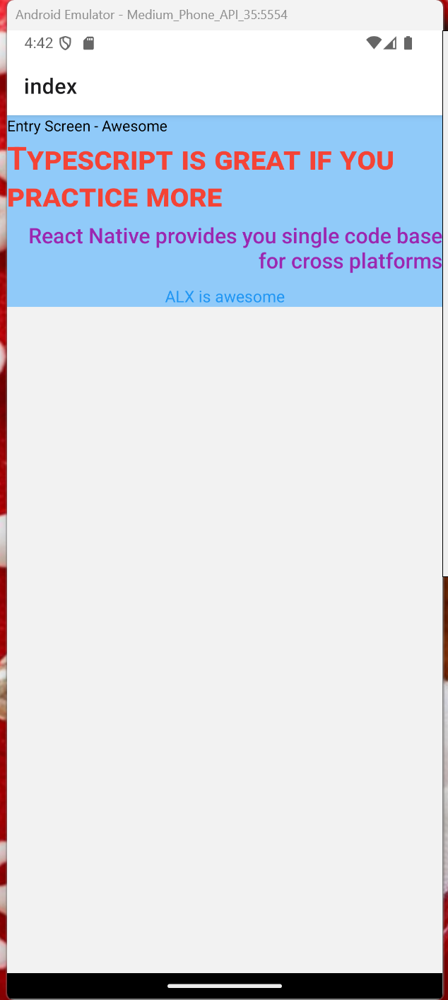

# Mobile Development with React Native

## Introduction to Mobile Development with React Native, TypeScript, NativeWindCSS (Using Expo Framework)

Mobile development has evolved significantly over the years, with frameworks and tools that enable developers to build high-quality, cross-platform applications efficiently. One such powerful combination is `React Native`, `TypeScript`, `NativeWindCSS`, and the `Expo framework`. This stack allows developers to create performant, scalable, and visually appealing mobile applications for both iOS and Android platforms with a single codebase.

We’ll explore how to get started with mobile development using these technologies, their benefits, and how they work together seamlessly.

## What is React Native?

React Native is an open-source framework developed by Facebook (now Meta) for building cross-platform mobile applications using JavaScript and React. It allows developers to write code once and deploy it on both iOS and Android platforms, saving time and effort. React Native uses native components under the hood, ensuring that the apps look and feel like native applications.

## Why TypeScript?

TypeScript is a strongly typed superset of JavaScript that adds optional static typing to the language. By using TypeScript in your React Native projects, you can:

- Catch errors during development (rather than at runtime).
- Improve code readability and maintainability.
- Enhance developer productivity with better tooling and autocompletion.
- Scale your application more effectively as it grows in complexity.

## What is NativeWindCSS?

NativeWindCSS is a utility-first CSS framework tailored for React Native. It allows you to style your components using a set of pre-defined utility classes, similar to TailwindCSS. With NativeWindCSS, you can: - Write styles directly in your JSX using class names. - Maintain a consistent design system across your application. - Reduce the need for writing custom CSS. - Leverage responsive design and dark mode support effortlessly.

## Why Use Expo?

Expo is a framework and platform built on top of React Native that simplifies the development process. It provides a set of tools and services that make it easier to build, deploy, and manage React Native applications. Some key benefits of using Expo include:

- **Quick setup**: Expo handles the complex configuration of native code, so you can focus on building your app.
- **Expo Go**: A development client that allows you to test your app on physical devices without needing to build it.
- **Pre-built components**: Access to a wide range of pre-built UI components and APIs (e.g., camera, maps, notifications).
- **Over-the-air updates**: Push updates to your app without going through the app store approval process.

## Getting Started with React Native, TypeScript, NativeWindCSS, and Expo

1. **Set Up Your Development Environment**
Before you start, ensure you have the following installed:

   - Node.js (v16 or higher)
   - Expo CLI (`npm install -g expo-cli`)
   - A code editor (e.g., VS Code)

2. **Create a New Expo Project**
Run the following command to create a new Expo project with TypeScript: `npx create-expo-app MyApp cd MyApp`

3. **Run Your App**
Start the development server: `npx expo start` Scan the QR code with the Expo Go app on your phone, or open the app in an emulator.

## Benefits of This Stack

- **Cross-platform development**: Write once, run on both iOS and Android.
- **Type safety**: TypeScript ensures fewer runtime errors and better code quality.
- **Efficient styling**: NativeWindCSS simplifies styling with utility-first CSS.
- **Rapid development**: Expo’s tools and services speed up the development process.

Combining React Native, TypeScript, NativeWindCSS, and Expo provides a robust and efficient way to build modern mobile applications. Whether you’re a beginner or an experienced developer, this stack offers the tools and flexibility needed to create high-quality apps quickly. Start building your next mobile app today with this powerful combination! 🚀

## Important to Analyze

- Take your time to analyze the following mock up [here](https://www.figma.com/design/E2BRqdPcKkrnX6hLGPto8Z/Project-Airbnb?node-id=1-2&p=f&t=4zHBmiAOSrQ74J1A-0). It will give you a good start to every screen we will implement in this section.

## 📝 Project Assessment (Hybrid)

Your project will be evaluated primarily through **manual reviews**. To ensure you receive your full score, please:

✅ Complete your project on time
📄 Submit all required files
🔗 Generate your review link
👥 Have your peers review your work

An **auto-check** will also be in place to verify the presence of core files needed for manual review.

⏰ Important Note
If the deadline passes, you won’t be able to generate your review link—so be sure to submit on time!

## Tasks

### 0. Setting Up and Testing Your Mobile Development Environment Objective

**mandatory**

**Objective**
Mobile development demands more computational resources compared to web development. To ensure a smooth development experience, we will be using the `Expo Framework` for React Native, which simplifies mobile app development and testing.

To successfully complete this task, ensure you have the following:

- Node.js LTS installed
- VS Code (our recommended IDE)
- macOS, Linux, or Windows
- Expo Go installed on your physical device (Android or iOS)

These tools are essential for completing the upcoming projects efficiently.

**Instructions**
By now, you should already have `Node.js` `LTS`, `VS Code`, and a compatible operating system installed. This task focuses on setting up Expo Go on your physical device.

**Why Expo Go?**
Unlike web development, mobile development relies on device emulators to test applications. However, keeping up with the ever-evolving mobile ecosystem (e.g., iPhone 7 → iPhone 16 Pro Max, various Android devices) can be costly in terms of hardware requirements.

**Expo Go** provides a cost-effective solution by allowing you to test and run your React Native applications directly on your physical device, supporting both iOS and Android seamlessly.

**Steps to Install Expo Go**
1. Visit the official Expo Go [homepage](https://expo.dev/go).
2. Select the latest SDK version.
3. Click on **Install** for your device:
   - Android: Install from the [Google Play Store](https://play.google.com/store/apps/details?id=host.exp.exponent).
   - iOS: Install from the [Apple App Store](https://apps.apple.com/us/app/expo-go/id982107779).
4. Open the Expo Go app on your device.
5. Create a new account or log in if you already have one.

Document your setup process and any challenges faced in the [README.md](./mobile-development-setup/README.md) file. This will help you track your progress and troubleshoot any issues that arise during development.

**Repo**:

- **GitHub repository**: **prodev-mobile-setup**
- **Directory**: **mobile-development-setup**
- **File**: [README.md](./mobile-development-setup/README.md)

### 1. Create Your First Mobile App

**mandatory**

**Objective**:
Set up your first mobile application using the Expo Router template. Document the scaffolding process and understand the file structure of a React Native application using Expo.

**Instructions**:
**Navigate to Your Project Directory**

Open your terminal and move to your parent project directory:

```bash
cd prodev-mobile-setup
```

**Set Up Your Project**

Initialize a new Expo project using the latest Expo Router template:

```bash
npx create-expo-app@latest .
```

**Modify the Home Screen**

- Open `app/(tabs)/index.tsx.`
- Locate the default text `Welcome!`.
- Change it to `**First App Created**`.

**Run and Test Your Application**

Start the Expo development server with:

```bash
npx expo start
```

- For iOS Devices: Scan the QR code in the terminal using your phone’s Camera app.
- For Android Devices: Scan the QR code using the Expo Go app.

**Reset the Application**

Run the reset command and observe its effects:

```bash
npm run reset-project
```

Document what happens when you reset the project in your README.md file.

**Ensure your `README.md` includes**

- Steps you followed for scaffolding.
- Observations from the `reset-project` command.

**Repo**:

- **GitHub repository**: **prodev-mobile-setup**
- **Directory**: **prodev-mobile-app-0x00**
- **File**: [README.md](./prodev-mobile-app-0x00/README.md), [app-example/app/(tabs)/index.tsx](./prodev-mobile-app-0x00/app-example/app/(tabs)/index.tsx), [app-example](./prodev-mobile-app-0x00/app-example), [app-example/constants/Colors.tsx](./prodev-mobile-app-0x00/app-example/constants/Colors.tsx)

### 2. Implementing Mobile Components in React Native

**mandatory**

**React Native Components and Styling**
**Objectives**
In React Native, you work with predefined components that translate directly into native components on iOS and Android. These components act as the building blocks of your application, much like HTML elements (such as `<div>` and `<p>`) in web development.

For example: - Instead of `<div>` in web development, you use `<View>` in React Native. - Instead of `<p>` for text content, you use `<Text>`.

By leveraging these predefined components, React Native ensures that your app maintains the native look and feel on both platforms while keeping development efficient.

**Styling in React Native**
Just like in web development, where you use CSS to style HTML elements, React Native provides a flexible styling system that allows you to customize your components. Styling in React Native is typically done using JavaScript objects, similar to inline styles in React web applications.

[]

#### Instructions

1. Initialize a new Expo project using the latest Expo Router template with the name prodev-mobile-app-0x01
2. Reset Your Application Remove the default template to start with a clean slate.
3. Update app/index.tsx Change the text inside the main <Text> component to "Entry Screen - Awesome".
4. Modify the Root <View> Component Replace the inline style attribute with style={styles.container}.
5. Add Additional Text Components Insert three extra <Text> components inside a <View> component. Apply styles to each text component as specified:

```typescript
<View>
  <Text style={styles.largeText}>Typescript is great if you practice more</Text>
  <Text style={styles.mediumText}>React Native provides you a single codebase for cross platforms</Text>
  <Text style={styles.smallText}>ALX is awesome</Text>
</View>
```

#### Define Your Styles

Import StyleSheet at the top of your file app/index.tsx and add the following styles:

```typescript
const styles = StyleSheet.create({
  container: {
    backgroundColor: "#90caf9",
  },
  largeText: {
    fontSize: 30,
    color: "#f44336",
    marginBottom: 5,
    fontWeight: "700",
    fontVariant: ["small-caps"],
  },
  mediumText: {
    fontSize: 20,
    color: "#9c27b0",
    marginBottom: 10,
    fontWeight: "500",
    textAlign: "right",
  },
  smallText: {
    fontSize: 15,
    color: "#2196f3",
    fontWeight: "400",
    textAlign: "center",
  },
});
```

**Repo**:

- **GitHub repository**: **prodev-mobile-setup**
- **Directory**: **prodev-mobile-app-0x01**
- **File**: [app/index.tsx](./prodev-mobile-app-0x01/app/index.tsx)

### 3. Implementing Safe Areas, Images, and Touchable Components in React Native

**mandatory**

**Objectives:**
In this task, you will explore essential React Native components like SafeAreaView, Image, ImageBackground, TouchableOpacity, and Dimensions. These components are crucial for building visually appealing and responsive applications.


#### Instructions:

**Set Up Your Project**

- Ensure your project structure follows the correct format `npx create-expo-app@latest`
- Clear any unnecessary files or templates from previous tasks. `npm run reset-project`

**Move the following files into `assets/images`**

- Logo.png
- background-image.png

**Modify your app/index.tsx file**

Implement Safe Areas and Background Image

Wrap your entire app inside SafeAreaProvider and SafeAreaView to prevent UI overlap with device notches.

```typescript
import { SafeAreaView, SafeAreaProvider } from "react-native-safe-area-context";

<SafeAreaProvider>
  <SafeAreaView style={{ flex: 1 }}>
    {/* Other components go here */}
  </SafeAreaView>
</SafeAreaProvider>
```

Import the following components `ImageBackground`, `Dimensions`, `View`, `Text`, `TouchableOpacity`, `Image` at the top of your file

Insert the following code between the SafeAreaView component

```typescript
<ImageBackground
  source={require("@/assets/images/background-image.png")}
  style={styles.background}
  resizeMode="cover"
>
  {/* Other components go here */}
</ImageBackground>
```

Set a full-screen background image using ImageBackground with resizeMode=“cover” and ensure the background image covers the entire screen using Dimensions.get(“window”).height

**Display the Company Logo**

Inside a component, center an Image component to display the company logo from the assets folder.

```typescript
<View style={styles.companyLogo}>
  <Image source={require("@/assets/images/Logo.png")} />
</View>
```

**Add Text Elements**

Include a title with the text “Find your favorite place here” styled as textLarge. Add two smaller text lines beneath:

```typescript
<View style={styles.textGroup}>
  <Text style={styles.textLarge}>Find your favorite place here</Text>
  <Text style={styles.textSmall}>The best prices for over 2 </Text>
  <Text style={styles.textSmall}>million properties worldwide</Text>
</View>
```

**Create a Button Group**

Use `TouchableOpacity` to create two buttons: “Join here” (styled with a white background and black text). “Sign In” (styled with a transparent background and white text).

```typescript
<View style={styles.buttonGroup}>
  <TouchableOpacity style={styles.button}>
    <Text style={{ ...styles.textSmall, color: "black" }}>Join here</Text>
  </TouchableOpacity>

  <TouchableOpacity style={styles.transparentButton}>
    <Text style={styles.textSmall}>Sign In</Text>
  </TouchableOpacity>
</View>
```

**Add a Navigation Prompt**

At the bottom of the screen, add a Text component with “Continue to home” to act as a prompt for navigation.

```typescript
<View style={{ alignItems: "center", paddingVertical: 20 }}>
  <Text style={{ color: "white" }}>Continue to home</Text>
</View>
```

**Apply Styles**

Define the required styles to ensure proper layout and design.

```typescript
const styles = StyleSheet.create({
  container: {
    flex: 1,
  },
  background: {
    flex: 1,
    justifyContent: "center",
    width: "100%",
    height: Dimensions.get("window").height,
  },
  companyLogo: {
    width: "100%",
    alignItems: "center",
    padding: 20,
    marginBottom: 50,
  },
  textGroup: {
    alignItems: "center",
  },
  textLarge: {
    color: "white",
    fontWeight: "800",
    fontSize: 40,
    textAlign: "center",
    marginBottom: 12,
  },
  textSmall: {
    color: "white",
    fontSize: 18,
    fontWeight: "200",
    textAlign: "center",
  },
  transparentButton: {
    borderColor: "white",
    borderWidth: 2,
    borderRadius: 40,
    paddingVertical: 15,
    paddingHorizontal: 5,
    alignItems: "center",
    fontSize: 20,
    flex: 1,
  },
  button: {
    borderColor: "white",
    borderWidth: 2,
    borderRadius: 40,
    paddingVertical: 15,
    paddingHorizontal: 5,
    alignItems: "center",
    fontSize: 20,
    backgroundColor: "white",
    flex: 1,
  },
  buttonGroup: {
    flexDirection: "row",
    gap: 20,
    paddingHorizontal: 20,
  },
});
```

**Final Code Snippet**

Combining all components into the final view:

```typescript
import { Text, View, StyleSheet, Image, ImageBackground, Dimensions, TouchableOpacity } from "react-native";
import { SafeAreaView, SafeAreaProvider } from "react-native-safe-area-context";

export default function Index() {
  return (
    <SafeAreaProvider>
      <SafeAreaView style={{ flex: 1 }}>
        <ImageBackground
          source={require("@/assets/images/background-image.png")}
          style={styles.background}
          resizeMode="cover"
        >
          <View style={styles.container}>
            <View style={styles.companyLogo}>
              <Image source={require("@/assets/images/Logo.png")} />
            </View>

            <View style={styles.textGroup}>
              <Text style={styles.textLarge}>Find your favorite place here</Text>
              <Text style={styles.textSmall}>The best prices for over 2 </Text>
              <Text style={styles.textSmall}>million properties worldwide</Text>
            </View>

            <View style={{ position: "absolute", bottom: 0, width: "100%" }}>
              <View style={styles.buttonGroup}>
                <TouchableOpacity style={styles.button}>
                  <Text style={{ ...styles.textSmall, color: "black" }}>Join here</Text>
                </TouchableOpacity>

                <TouchableOpacity style={styles.transparentButton}>
                  <Text style={styles.textSmall}>Sign In</Text>
                </TouchableOpacity>
              </View>
              <View style={{ alignItems: "center", paddingVertical: 20 }}>
                <Text style={{ color: "white" }}>Continue to home</Text>
              </View>
            </View>
          </View>
        </ImageBackground>
      </SafeAreaView>
    </SafeAreaProvider>
  );
}
```

**Repo**:

- **GitHub repository**: **prodev-mobile-setup**
- **Directory**: **prodev-mobile-app-0x02**
- **File**: [app/index.tsx](./prodev-mobile-app-0x02/app/index.tsx)

### 4. Explore More Core Components

**mandatory**

**Objectives**:
React Native provides developers with a set of predefined components that render natively on both iOS and Android. You can find more details here: [React Native Components](https://reactnative.dev/docs/components-and-apis)

To gain hands-on experience, you will build a sample app that implements some of these core components. This exercise will help reinforce your understanding and improve your coding efficiency.

**Note**: Avoid copying and pasting code. Instead, type each line manually to enhance retention and familiarity with the syntax.


#### Instructions:

#### Step 1: Set Up Your Project

**Create a new expo app in the directory prodev-mobile-app-0x03 using the following command**:

```bash
npx create-expo-app@latest prodev-mobile-app-0x03
```

**Navigate into the project directory**:

```bash
cd prodev-mobile-app-0x03
```

**Reset the project using**:

```bash
npm run reset-project
```

Download the required assets from here and place them in the assets/images directory inside your project.

#### Step 2: Implement Styles

Create the following file `styles/index.tsx` under the project root directory. Open `styles/index.tsx` and define the following styles **(type manually, do not copy-paste)**:

```typescript
import { StyleSheet } from "react-native";

const styles = StyleSheet.create({
  container: {
    flex: 1,
    padding: 20,
    backgroundColor: '#fff',
    position: 'relative'
  },
  navGroup: {
    flexDirection: 'row',
    justifyContent: 'space-between',
    marginBottom: 20,
    marginTop: 11
  },
  largeText: {
    fontSize: 40,
    fontWeight: 700,
  },
  smallText: {
    fontSize: 12,
    color: '#7E7B7B'
  },
  placeholderText: {
    fontSize: 18,
    color: '#7E7B7B',
    marginBottom: 7
  },
  inputField: {
    borderWidth: 1,
    borderRadius: 10,
    height: 50,
    borderColor: '#7E7B7B',
    paddingHorizontal: 10
  },
  passwordGroup: {
    flexDirection: 'row',
    borderWidth: 1,
    alignItems: 'center',
    height: 50,
    borderRadius: 10,
    paddingHorizontal: 10,
    borderColor: '#7e7b7b'
  },
  formGroup: {
    marginTop: 44
  },
  forgotPasswordText: {
    fontSize: 17,
    marginTop: 9,
    textAlign: 'right',
    color: '#34967C'
  },
  button: {
    backgroundColor: '#2B876E',
    height: 53,
    borderRadius: 10,
    marginTop: 25,
    justifyContent: 'center',
    alignItems: 'center'
  },
  buttonText: {
    fontSize: 17,
    color: 'white'
  },
  socialMediaButton: {
    borderWidth: 1,
    height: 50,
    justifyContent: 'center',
    alignItems: 'center',
    borderRadius: 10
  },
  socialMediaButtonText: {
    fontSize: 18,
    color: '#0D0D0D',
    fontWeight: 400
  },
  socialMediaButtonGroup: {
    gap: 15,
    marginTop: 25
  },
  dividerGroup: {
    flexDirection: 'row',
    alignItems: 'center',
    gap: 10,
    marginTop: 29
  },
  divider: {
    borderWidth: 0.5,
    borderColor: "#c2c2c2",
    flex: 1
  },
  dividerText: {
    fontSize: 17,
    color: "#C2C2C2",
  },
  subTextGroup: {
    flexDirection: 'row',
    position: 'absolute',
    bottom: 33,
    left: 77,
    right: 76
  },
  subText: {
    fontSize: 18,
    color: '#b5b5b5'
  },
  subTextJoin: {
    fontSize: 18,
    color: '#FFA800',
    fontWeight: 600
  }
});


export {
  styles
}
```

#### Step 3: Modify App Files

**Modify your `app/_layout.tsx` file to look like this**

```typescript
import { Stack } from "expo-router";

export default function RootLayout() {
  return <Stack screenOptions={{
    headerShown: false
  }} />;
}
```

**Modify `app/index.tsx` to structure the login screen**:

```typescript
import { Text, TextInput, View, TouchableOpacity, Image } from "react-native";
import { styles } from "@/styles";
import { SafeAreaView, SafeAreaProvider } from "react-native-safe-area-context";
import { FontAwesome, Ionicons } from "@expo/vector-icons";

export default function Index() {
  return (
    <SafeAreaProvider>
      <SafeAreaView style={styles.container}>
        <View style={styles.navGroup}>
          <Ionicons name="arrow-back" size={25} />
          <Image source={require('@/assets/images/logo.png')} />
        </View>
        <Text style={styles.largeText}>Sign in to your</Text>
        <Text style={styles.largeText}>Account</Text>
        <Text style={styles.smallText}>
          Enter your email and password to sign in.
        </Text>

        <View style={styles.formGroup}>
          <View>
            <Text style={styles.placeholderText}>Email</Text>
            <TextInput keyboardType="email-address" style={styles.inputField} />
          </View>
          <View style={{ marginTop: 20 }}>
            <Text style={styles.placeholderText}>Password</Text>
            <View style={styles.passwordGroup}>
              <TextInput style={{ flex: 1 }} />
              <FontAwesome name="eye-slash" size={24} color="#7E7B7B" />
            </View>
          </View>
          <Text style={styles.forgotPasswordText}>Forgot password?</Text>
        </View>

        <TouchableOpacity style={styles.button}>
          <Text style={styles.buttonText}>Sign in</Text>
        </TouchableOpacity>

        <View style={styles.dividerGroup}>
          <View
            style={styles.divider}
          ></View>
          <Text
            style={styles.dividerText}
          >
            OR
          </Text>
          <View
            style={styles.divider}
          ></View>
        </View>

        <View style={styles.socialMediaButtonGroup}>
          <TouchableOpacity style={styles.socialMediaButton}>
            <View
              style={{
                flexDirection: "row",
                alignItems: "center",
                gap: 5,
              }}
            >
              <Image source={require("@/assets/images/google.png")} />
              <Text style={styles.socialMediaButtonText}>
                Continue with Google
              </Text>
            </View>
          </TouchableOpacity>

          <TouchableOpacity style={styles.socialMediaButton}>
            <View
              style={{
                flexDirection: "row",
                alignItems: "center",
                gap: 5,
              }}
            >
              <Image source={require("@/assets/images/facebook.png")} />
              <Text style={styles.socialMediaButtonText}>
                Continue with Facebook
              </Text>
            </View>
          </TouchableOpacity>
        </View>

        <View style={styles.subTextGroup}>
          <Text style={styles.subText}>Don't have an account?</Text>
          <Text style={styles.subTextJoin}>Join now</Text>
        </View>
      </SafeAreaView>
    </SafeAreaProvider>
  );
}
```

#### Final Steps 1. Run the application on Expo Go:

```bash
npx expo start
```

Test the app on a physical device using Expo Go App and confirm all render correctly.

**Repo**:

- **GitHub repository**: **prodev-mobile-setup**
- **Directory**: **prodev-mobile-app-0x03**
- **File**: [app/index.tsx,styles/index.tsx,app/_layout.tsx](./prodev-mobile-app-0x03/app/index.tsx,styles/index.tsx,app/_layout.tsx), [app.json,assets/images/google.png,assets/images/logo.png,assets/images/splash.png,assets/images/facebook.png](./prodev-mobile-app-0x03/app.json,assets/images/google.png,assets/images/logo.png,assets/images/splash.png,assets/images/facebook.png)
