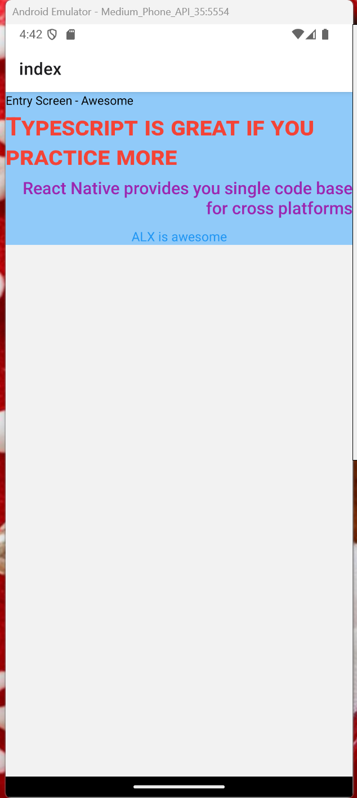

### 2. Implementing Mobile Components in React Native

**mandatory**

**React Native Components and Styling**
**Objectives**
In React Native, you work with predefined components that translate directly into native components on iOS and Android. These components act as the building blocks of your application, much like HTML elements (such as `<div>` and `<p>`) in web development.

For example: - Instead of `<div>` in web development, you use `<View>` in React Native. - Instead of `<p>` for text content, you use `<Text>`.

By leveraging these predefined components, React Native ensures that your app maintains the native look and feel on both platforms while keeping development efficient.

**Styling in React Native**
Just like in web development, where you use CSS to style HTML elements, React Native provides a flexible styling system that allows you to customize your components. Styling in React Native is typically done using JavaScript objects, similar to inline styles in React web applications.



#### Instructions

1. Initialize a new Expo project using the latest Expo Router template with the name prodev-mobile-app-0x01

   ```bash
      npx create-expo-app@latest prodev-mobile-app-0x01 -t
   ```

2. Reset Your Application Remove the default template to start with a clean slate.

   ```bash
   npm run reset-project
   ```

3. Update app/index.tsx Change the text inside the main <Text> component to "Entry Screen - Awesome".
4. Modify the Root <View> Component Replace the inline style attribute with style={styles.container}.
5. Add Additional Text Components Insert three extra <Text> components inside a <View> component. Apply styles to each text component as specified:

```typescript
<View>
  <Text style={styles.largeText}>Typescript is great if you practice more</Text>
  <Text style={styles.mediumText}>React Native provides you a single codebase for cross platforms</Text>
  <Text style={styles.smallText}>ALX is awesome</Text>
</View>
```

#### Define Your Styles

Import StyleSheet at the top of your file app/index.tsx and add the following styles:

```typescript
const styles = StyleSheet.create({
  container: {
    backgroundColor: "#90caf9",
  },
  largeText: {
    fontSize: 30,
    color: "#f44336",
    marginBottom: 5,
    fontWeight: "700",
    fontVariant: ["small-caps"],
  },
  mediumText: {
    fontSize: 20,
    color: "#9c27b0",
    marginBottom: 10,
    fontWeight: "500",
    textAlign: "right",
  },
  smallText: {
    fontSize: 15,
    color: "#2196f3",
    fontWeight: "400",
    textAlign: "center",
  },
});
```

**Repo**:

- **GitHub repository**: **prodev-mobile-setup**
- **Directory**: **prodev-mobile-app-0x01**
- **File**: [app/index.tsx](./prodev-mobile-app-0x01/app/index.tsx)
